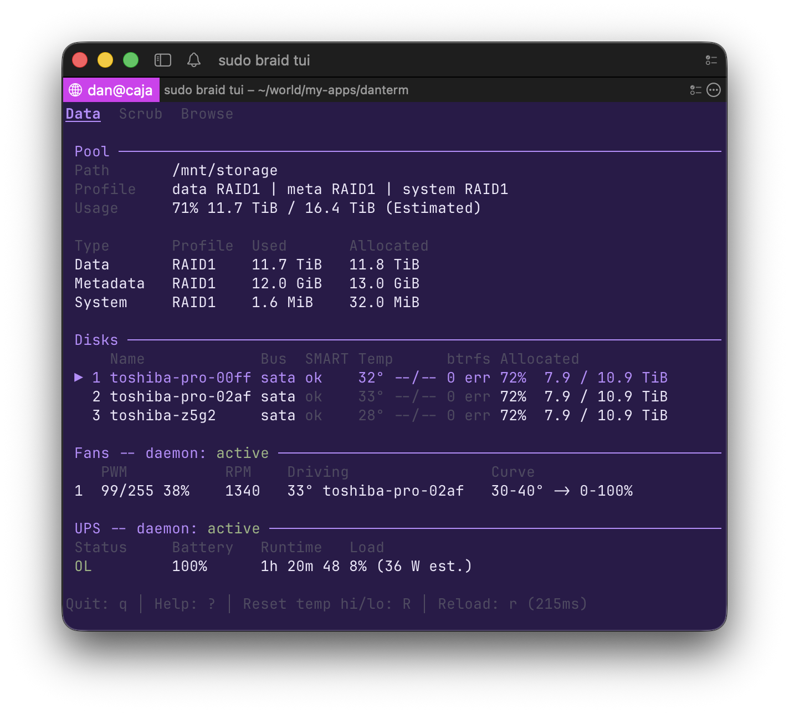

# braid

[](https://braid.cachix.org)

braid is a CLI + NixOS module for managing an encrypted RAID1 disk array for
data storage. It packs extra goodies for the
[NAS](https://en.wikipedia.org/wiki/Network-attached_storage) use case:
USB-keyfile auto-unlock on boot, disk-failure alerts, scheduled scrubs, and
UPS-safe poweroff.

It wraps two standard Linux tools into a simple interface:

- **[LUKS](https://en.wikipedia.org/wiki/Linux_Unified_Key_Setup)** -- full disk encryption (passphrase-based, keys never stored on disk)
- **[btrfs RAID1](https://btrfs.readthedocs.io/en/latest/)** -- checksumming filesystem with automatic self-healing from redundant copies

And it leans heavily on **[systemd](https://systemd.io/)**, built into NixOS: the
unlock/mount lifecycle, scrub timers, and UPS/fan/suspend services all run as
systemd units.

Full manual: [danneu.github.io/braid](https://danneu.github.io/braid/).



## Quick start

Once the NixOS module is installed (see [Install](#install)), the whole NAS
lifecycle is a handful of commands. Full walkthrough:
[Getting started](docs/guides/getting-started.md).

**Find your disks.** braid only accepts stable `/dev/disk/by-id/` paths --
`/dev/sdX` names can change between reboots:

```
lsblk -d -o NAME,SIZE,MODEL,ID-LINK

NAME   SIZE MODEL               ID-LINK
sda   10.9T TOSHIBA MN07ACA12T  ata-TOSHIBA_MN07ACA12T_XXXX
sdb   10.9T TOSHIBA MN07ACA12T  ata-TOSHIBA_MN07ACA12T_YYYY
sdc  465.8G Samsung SSD 860     ata-Samsung_SSD_860_AAAA     <- boot drive, leave it alone
```

**Create the pool.** Pick a short name for each drive and set one passphrase.
braid shows exactly what it is about to destroy and waits for an explicit yes:

```
sudo braid add toshiba1=/dev/disk/by-id/ata-TOSHIBA_MN07ACA12T_XXXX \
               toshiba2=/dev/disk/by-id/ata-TOSHIBA_MN07ACA12T_YYYY

Add to pool:
  toshiba1  /dev/disk/by-id/ata-TOSHIBA_MN07ACA12T_XXXX
            TOSHIBA MN07ACA12T | 10.91 TiB | serial XXXX
            Will be LUKS-formatted (existing data will be inaccessible)
  toshiba2  /dev/disk/by-id/ata-TOSHIBA_MN07ACA12T_YYYY
            TOSHIBA MN07ACA12T | 10.91 TiB | serial YYYY
            Will be LUKS-formatted (existing data will be inaccessible)

Type 'yes' to continue: yes
LUKS passphrase:
Confirm LUKS passphrase:
[wait] disk toshiba1: formatting LUKS...
[ok]   disk toshiba1: LUKS formatted
LUKS header backed up: /var/lib/braid/luks-headers/braid-toshiba1.luksheader
[wait] disk toshiba1: unlocking...
[ok]   disk toshiba1: unlocked
...
Pool created (RAID1) and mounted at /mnt/storage
Done. toshiba1, toshiba2 are now part of the pool.
```

The pool is now an ordinary directory:

```sh
cp -r ~/photos /mnt/storage/
```

**Check pool health.** `braid status` shows the pool, capacity, and two layers
of per-disk health: btrfs's own I/O accounting and the drive's SMART
self-report:

```
sudo braid status

Pool:     /mnt/storage
Status:   intact
FSID:     f5f5f5f5-aaaa-bbbb-cccc-d0d0d0d0d0d0
Profile:
  Data:      RAID1
  Metadata:  RAID1
  System:    RAID1
...
Drives:
  toshiba1     sda  devid=1  present
  toshiba2     sdb  devid=2  present

Capacity:
  Total:  10.91 TiB (Estimated)
  Used:   1.21 TiB
  Free:   9.66 TiB

Last scrub: Mon Jun  1 03:00:00 2026 (no errors)

Disks:

  toshiba1          devid 1   present
    Device:  /dev/disk/by-id/ata-TOSHIBA_MN07ACA12T_XXXX
    Model:   TOSHIBA MN07ACA12T
    Serial:  XXXX
    LUKS:    aaaaaaaa-1111-2222-3333-444444444444
    btrfs:   read 0 / write 0 / flush 0 / corruption 0 / generation 0
    SMART:   ok

  ...
```

**After every reboot.** The drives stay encrypted and the pool stays offline
until you unlock it:

```
sudo braid unlock

LUKS passphrase:
```

`sudo braid lock` takes the pool offline again by hand; shutdown locks it
automatically. To unlock on boot without typing the passphrase, enable
`braid.autoUnlock` with a USB keyfile ([Auto-unlock](docs/guides/auto-unlock.md)).

**When a disk dies.** `braid status` flags the failure and hands you the exact
repair command on the `Action:` line:

```
sudo braid status

Pool:     /mnt/storage
Status:   DEGRADED (1 missing device)
...
Drives:
  toshiba1     sda  devid=1  present
  toshiba2     -    devid=2  missing
...
  toshiba2          MISSING
    Device:  /dev/disk/by-id/ata-TOSHIBA_MN07ACA12T_YYYY  (not found)
    btrfs:   unknown (device absent)
    SMART:   unknown (device absent)
    Action:  braid replace --old toshiba2 --new <new-name>=/dev/disk/by-id/<...>
```

Plug in a replacement drive and run the command from the `Action:` line:

```sh
sudo braid replace --old toshiba2 --new wd1=/dev/disk/by-id/ata-WDC_WD120EFBX-68B0EN0_ZZZZ
```

btrfs rebuilds the dead disk's data onto the new drive from the surviving
copy.

Grow the pool any time by running `braid add` again with another drive. Every
mutating command previews its full plan with `--dry-run` and asks for
confirmation before touching disks -- see [Safety](#safety). Full usage of
every command: [command reference](docs/commands/).

## Features

- **Full disk encryption** -- passphrase or USB keyfile to unlock; every LUKS
  format writes a header backup to `/var/lib/braid/luks-headers/`
- **Redundancy** -- two copies of every block; tolerates a single disk failure
- **Self-healing** -- btrfs checksums every block and repairs corruption from
  the redundant copy; scheduled scrubs sweep the whole array
- **Dynamic pool** -- add, remove, or replace drives with one command, no
  `nixos-rebuild`; membership lives in UUID-keyed `/var/lib/braid/pool.json`
- **Offline-write safety** -- the unmounted mountpoint is sealed immutable, so
  stray writes fail with `EPERM` instead of landing on the root disk
- **Monitoring** -- btrfs error counters and smartd health checks raise
  alerts, beep the PC speaker until acknowledged (`braid ack`), and can run a
  custom notify command
- **Fail-closed mutations** -- an interrupted command leaves a marker that
  blocks further mutations until `braid recover` finishes the job or refuses
- **UPS safety** -- with UPS support enabled, NUT drives orderly poweroff on low battery, mutating commands refuse to start unless UPS utility power is verified, and `braid ups status` / the TUI show live UPS state
- **TUI dashboard** -- `braid tui` shows pool health, disk status, balance progress, SMART data, and (when enabled) chassis fan telemetry plus UPS state

## Why braid

- **vs. TrueNAS / Synology** -- braid is not an appliance. It's your own NixOS
  box: config in git, reproducible, no web-UI lock-in.
- **vs. ZFS on NixOS** -- btrfs RAID1 grows one drive at a time and tolerates
  mixed sizes; in-kernel, no out-of-tree module to chase kernel updates.
- **vs. hand-rolled LUKS + btrfs** -- braid is the playbook codified: correct
  ordering, confirmations, header backups, fail-closed recovery when a step
  is interrupted.

## Downsides

- **RAID1 capacity cost** -- half your raw capacity goes to redundancy. Four 12 TB drives = 24 TB usable.
- **HDD-first** -- defaults are tuned for spinning drives (e.g. no TRIM). SSDs may work but are not supported.
- **Unstable** -- this is pre-v1.0 and I change things when I decide on a better way. Commands, flags, config, and even on-disk state like `pool.json` format can change.
- **Unproven** -- I run braid on a daily-use 4x12TB NAS, and there are 180+ NixOS VM tests and 2200+ Rust tests, but there are almost certainly weird/bad edge cases. That said, every mutating command takes a `--dry-run` flag, so you can preview exactly what it'll do before it touches your disks.

## Install

> NixOS/Linux only (x86_64). The CLI wraps Linux storage tooling (LUKS, btrfs,
> systemd) and does not run on macOS.

Try it without installing anything:

```sh
nix run github:danneu/braid?ref=release -- --help
```

Add braid to your flake inputs and import the module:

```nix
# flake.nix
{
  inputs = {
    nixpkgs.url = "github:NixOS/nixpkgs/nixos-26.05";
    braid.url = "github:danneu/braid?ref=release";
  };

  outputs = { nixpkgs, braid, ... }: {
    nixosConfigurations.myhost = nixpkgs.lib.nixosSystem {
      system = "x86_64-linux";
      modules = [
        braid.nixosModules.default
        ./configuration.nix
      ];
    };
  };
}
```

```nix
# configuration.nix
braid = {
  enable = true;
  mountPoint = "/mnt/storage";  # default
};
```

`?ref=release` tracks braid's release channel (`nix flake update braid` upgrades).
Pin a fixed version instead with a tag or commit:

```nix
# flake.nix
braid.url = "github:danneu/braid?ref=v0.0.1";    # pin a tag
braid.url = "github:danneu/braid?rev=<commit>";  # pin an exact commit
```

Add braid's public binary cache so the NAS pulls the prebuilt CLI instead of
recompiling -- this relies on the no-`follows` input above, which keeps braid on
its pinned nixpkgs:

```nix
# configuration.nix
nix.settings = {
  extra-substituters = [ "https://braid.cachix.org" ];
  extra-trusted-public-keys = [ "braid.cachix.org-1:I/p7fx1z5n0+O80KzMuT7aXRdkVyHr/buZKaBu7HvJs=" ];
};
```

## Safety

Every pool mutation previews its plan, asks for confirmation, and fails closed
if interrupted. Alongside that, every LUKS format writes a header backup to
`/var/lib/braid/luks-headers/`, and the offline mountpoint is sealed immutable
so stray writes fail with `EPERM` instead of landing on the root disk.

### Preview with --dry-run

Add `--dry-run` to any pool-lifecycle command to print the exact plan -- every
LUKS, btrfs, and mount step it would run -- without touching your disks. Each
step is tagged `[destructive]`, `[safe]`, or `[long]` (a long-running step like a
btrfs balance), so you can see at a glance what each step does, and the `$` line
beneath each step is the literal command:

Here is the quick start's create-pool command again, with `--dry-run`:

```
sudo braid add toshiba1=/dev/disk/by-id/ata-TOSHIBA_MN07ACA12T_XXXX \
               toshiba2=/dev/disk/by-id/ata-TOSHIBA_MN07ACA12T_YYYY --dry-run

[destructive] LUKS format /dev/disk/by-id/ata-TOSHIBA_MN07ACA12T_XXXX
$ cryptsetup luksFormat --type luks2 --batch-mode '--key-file=-' --uuid '<generated-at-format-time>' --label braid-toshiba1 /dev/disk/by-id/ata-TOSHIBA_MN07ACA12T_XXXX
[safe] LUKS header backup -> /var/lib/braid/luks-headers/braid-toshiba1.luksheader
$ cryptsetup luksHeaderBackup --header-backup-file /var/lib/braid/luks-headers/braid-toshiba1.luksheader /dev/disk/by-id/ata-TOSHIBA_MN07ACA12T_XXXX
[safe] LUKS open -> braid-toshiba1
$ cryptsetup open --type luks '--key-file=-' --perf-no_read_workqueue --perf-no_write_workqueue /dev/disk/by-id/ata-TOSHIBA_MN07ACA12T_XXXX braid-toshiba1
[destructive] LUKS format /dev/disk/by-id/ata-TOSHIBA_MN07ACA12T_YYYY
$ cryptsetup luksFormat --type luks2 --batch-mode '--key-file=-' --uuid '<generated-at-format-time>' --label braid-toshiba2 /dev/disk/by-id/ata-TOSHIBA_MN07ACA12T_YYYY
[safe] LUKS header backup -> /var/lib/braid/luks-headers/braid-toshiba2.luksheader
$ cryptsetup luksHeaderBackup --header-backup-file /var/lib/braid/luks-headers/braid-toshiba2.luksheader /dev/disk/by-id/ata-TOSHIBA_MN07ACA12T_YYYY
[safe] LUKS open -> braid-toshiba2
$ cryptsetup open --type luks '--key-file=-' --perf-no_read_workqueue --perf-no_write_workqueue /dev/disk/by-id/ata-TOSHIBA_MN07ACA12T_YYYY braid-toshiba2
[safe] mkfs.btrfs RAID1 /dev/mapper/braid-toshiba1 /dev/mapper/braid-toshiba2
$ mkfs.btrfs -d raid1 -m raid1 -O block-group-tree /dev/mapper/braid-toshiba1 /dev/mapper/braid-toshiba2
[safe] mount -> /mnt/storage
$ mount -o 'noatime,skip_balance,subvolid=5' /dev/mapper/braid-toshiba1 /mnt/storage
```

### Confirm before it runs

Without `--dry-run`, the data-shape commands (`add`, `remove`, `remove-missing`,
`replace`) show what they are about to do and wait for you to type `yes` --
anything else aborts. Here, removing `wd1` from a pool that has grown to three
disks:

```
sudo braid remove wd1

Remove from pool:
  wd1  WDC WD120EFBX-68B0EN0 | 10.91 TiB | serial ZZZZ
       devid 3 | data will migrate to remaining disks

Pool: 3 disks -> 2 disks

Type 'yes' to continue:
```

Pass `--yes` to skip the prompt (for scripts and automation):

```
sudo braid remove wd1 --yes
```

### If a command is interrupted

An interrupted mutation leaves `/var/lib/braid/pending-op.json` behind, and
other commands refuse to run until you finish recovery with `sudo braid
recover`. Recovery completes the part that is safe to finish and refuses
anything ambiguous rather than guess. Details:
[recover](docs/commands/recover.md) and
[Recovery scenarios](docs/guides/recovery-scenarios.md).

## Docs

Published at [danneu.github.io/braid](https://danneu.github.io/braid/); the
same pages live in [docs/](docs/).

### Commands

Commands marked 🧪 are experimental: the idea or implementation is still uncertain and may be removed, replaced, or overhauled before braid v1.0.

| Command                                                | Description                                                        |
| ------------------------------------------------------ | ------------------------------------------------------------------ |
| [add](docs/commands/add.md)                            | Add disks to the pool (or create a new pool)                       |
| [remove](docs/commands/remove.md)                      | Remove a live disk from the pool                                   |
| [remove-missing](docs/commands/remove-missing.md)      | Forget a dead/missing device entry                                 |
| [replace](docs/commands/replace.md)                    | Replace a live or dead disk                                        |
| [unlock](docs/commands/unlock.md)                      | Open LUKS devices and mount the pool                               |
| [lock](docs/commands/lock.md)                          | Unmount the pool and close LUKS devices                            |
| [seal-mountpoint 🧪](docs/commands/seal-mountpoint.md) | Seal the offline mountpoint immutable (boot-managed; manual lever) |
| [idle 🧪](docs/commands/idle.md)                       | Check if the pool is idle (for auto-suspend)                       |
| [status](docs/commands/status.md)                      | Pool health, disk status, allocation, scrub info                   |
| [doctor](docs/commands/doctor.md)                      | Diagnostic checks for config, pool health, and runtime safety      |
| [monitor 🧪](docs/commands/monitor.md)                 | Health check for alerting (used by systemd timer)                  |
| [ack 🧪](docs/commands/ack.md)                         | Acknowledge and silence an active alert                            |
| [enroll 🧪](docs/commands/enroll.md)                   | Enroll a USB keyfile for auto-unlock                               |
| [discover 🧪](docs/commands/discover.md)               | Scan for braid LUKS devices and rebuild pool.json                  |
| [recover 🧪](docs/commands/recover.md)                 | Recover from an interrupted operation                              |
| [tui](docs/commands/tui.md)                            | Interactive dashboard with raw-output Browse tab                   |
| [ups status 🧪](docs/commands/ups-status.md)           | Live UPS state (NUT); `--json` for scripts                         |

### Guides

| Guide                                                             | Description                                                |
| ----------------------------------------------------------------- | ---------------------------------------------------------- |
| [Install NixOS](docs/guides/install-nixos.md)                     | Install NixOS itself before setting up braid               |
| [Getting started](docs/guides/getting-started.md)                 | First-time setup: find disks, create pool, unlock          |
| [Day-to-day NAS usage](docs/guides/day-to-day-nas-usage.md)       | Subvolumes, file permissions, Samba shares                 |
| [Auto-unlock](docs/guides/auto-unlock.md)                         | USB keyfile setup for unattended reboots                   |
| [Monitoring and alerts](docs/guides/monitoring-and-alerts.md)     | Disk health alerts, beeper, alert commands                 |
| [Power management](docs/guides/power-management.md)               | Auto-suspend, Wake-on-LAN, RTC wakeups                     |
| [Fan control](docs/guides/fan-control.md)                         | HDD-driven chassis fan control via hddfancontrol           |
| [UPS](docs/guides/ups.md)                                         | NUT-backed orderly poweroff, preflight safety, live status |
| [NixOS configuration](docs/guides/nixos-configuration.md)         | Module options, scrub scheduling, pinned toolchain         |
| [Sharing and permissions](docs/guides/sharing-and-permissions.md) | Storage group, mount permissions, Samba                    |
| [Mounting subvolumes](docs/guides/mounting-subvolumes.md)         | Expose a btrfs subvolume at a custom path                  |
| [Troubleshooting](docs/guides/troubleshooting.md)                 | ENOSPC balance, paused balance, missing devices            |
| [Recovery scenarios](docs/guides/recovery-scenarios.md)           | Interrupted operations, lost pool.json, degraded mount     |

### Development

See [docs/dev/overview.md](docs/dev/overview.md) for the dev workflow, test commands, and dependency upgrade process.

## How braid is built

braid is written almost entirely by AI agents. After 20 years of software work, this project is my attempt at finding a state-of-the-art approach to AI-heavy engineering.

It is not vibe-coded. Every change runs through a deliberate plan-first pipeline: I generally have Claude Code (`--effort max`) draft a plan, then I run a revision loop with other agents -- I answer their clarifying questions, choose among branching decisions, and double-check the direction -- until the plan is ratcheted into a final form. Then an agent implements the plan.

The plan file is the main unit of work in braid. That is where all of my attention is spent. Implementation is derived from the plan.

Contributors, if any, would submit plan files rather than code, then we would revision-cycle the plan until it's ready for agent implementation.

## License

[MIT](LICENSE)
